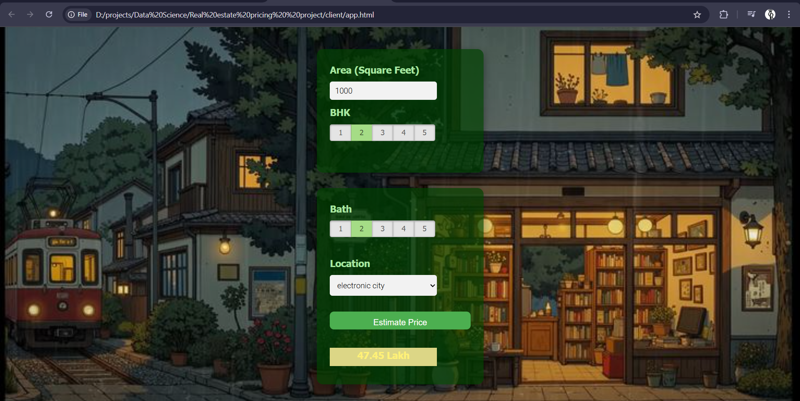

# Bangalore Home Price Prediction

## Project Overview

This project is a machine learning-based system that predicts home prices in Bangalore. The model uses location, square footage, number of bedrooms, bathrooms, and other factors to estimate property prices. A simple web interface is included to allow users to input details and receive instant predictions.

## Features

* Cleaned and preprocessed Bangalore housing dataset
* Outlier removal and feature engineering
* One-hot encoding for location values
* Model training using Linear Regression
* Hyperparameter tuning using GridSearchCV
* Flask-based backend for prediction API
* Simple web interface for user inputs
* Real-time prediction response

## Technologies Used

### Programming and Libraries

* Python
* NumPy
* Pandas
* Matplotlib
* Scikit-learn

### Backend

* Flask

### Frontend

* HTML  
* CSS  
* JavaScript

### Machine Learning

* Linear Regression
* Train-test split
* GridSearchCV
* Feature scaling and encoding

